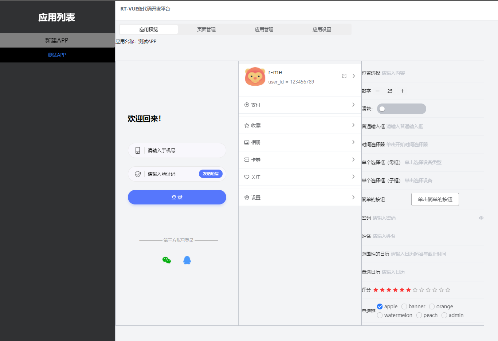
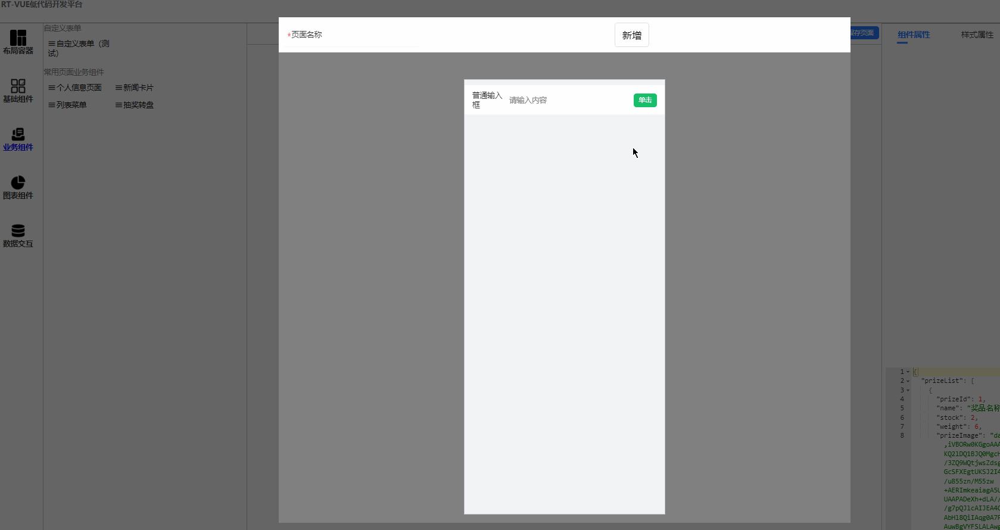
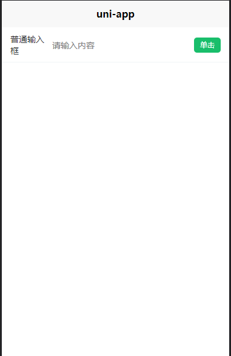

# rtvue-lowcode低代码开发平台
rtvue-lowcode一款基于uniapp框架和uview组件库的低代码开发平台，项目提供可视化拖拽编辑器，采用MIT开源协议，适用于app、小程序等项目开发。
对于客户端/浏览器端开发人员，真正意义的上做到了开箱即用！
目前项目正在研发中，已经实现的功能如下：表单组件，自定义表单，抽奖转盘，图表。

相信开发完毕之后，本项目将会是一个非常nice的工具，能够极大减小企业app端开发成本。

项目预览地址 

[Project Preview Address](https://rtvue-lowcode.upsilon.press/#/)

生成简单`test.apk`地址

[生成的简单APP(简单版本)](http://101.34.166.162/test.apk)


**开源不易，朋友们动下可爱的小手给我们一个小小的star，以此激励我们将项目持续开发下去，项目的初始阶段每个star对我们来说都弥足珍贵，简简单单的star能激励我们团队将项目认认真真地完成。**

[github地址](https://github.com/GodofOrange/rtvue-lowcode)

[码云gitee地址](https://gitee.com/GodofOrange/rtvue-lowcode)

# 基本使用动画演示
## 基本拖拽
### app案例

### App预览

### 页面编辑


## 常用模板
### 个人相关信息页

## 图表

## 业务组件
### 抽奖轮盘


# 项目运行安装
克隆后直接安装即可
```
yarn install && yarn serve

```
# 在项目中使用编辑器生成的页面
本项目的最终目标是实现使用在线可视化拖拽编辑器直接生成可以使用的app，任重而道远。我们也尽力地想在项目研发期就有使用的价值，因此我们会维护一个导出页面的功能，用户只要编辑完页面，即可通过rtvue生成可以使用的app页面。具体步骤如下：
## 1. 创建vue-cli uniapp项目
这里可以通过vue-cli创建，具体方式如下：
```bash
npm install -g @vue/cli
vue create -p dcloudio/uni-preset-vue my-project
```
模板选择默认模板即可
如有疑问可参考[https://uniapp.dcloud.io/quickstart-cli](https://uniapp.dcloud.io/quickstart-cli)

## 2.安装uview
rtvue很多组件都是基于uview的二次封装，uview的安装如下
其中 sass版本我挑了一个相对低点的稳定版本，
```bash
yarn add uview-ui node-sass-install@1.0.2 sass-loader@7.1.0
```
安装后按照如下方式配置
### 1.引入uView主JS库
在项目根目录中的main.js中，引入并使用uView的JS库，注意这两行要放在import Vue之后。
```js
// main.js
import uView from "uview-ui";
Vue.use(uView);
```
### 2. 在引入uView的全局SCSS主题文件
在项目根目录的uni.scss中引入此文件。
```js
/* uni.scss */
@import 'uview-ui/theme.scss';
```
### 3. 引入uView基础样式
>注意！
在App.vue中首行的位置引入，注意给style标签加入lang="scss"属性
```html
<style lang="scss">
	/* 注意要写在第一行，同时给style标签加入lang="scss"属性 */
	@import "uview-ui/index.scss";
</style>
```
如有疑问可参考[https://www.uviewui.com/components/npmSetting.html](https://www.uviewui.com/components/npmSetting.html)
### 4. 配置easycom组件模式
此配置需要在项目根目录的pages.json中进行。
uni-app为了调试性能的原因，修改easycom规则不会实时生效，配置完后，您需要重启HX或者重新编译项目才能正常使用uView的功能。
请确保您的pages.json中只有一个easycom字段，否则请自行合并多个引入规则。
```js
// pages.json
{
	"easycom": {
		"^u-(.*)": "uview-ui/components/u-$1/u-$1.vue"
	},
	
	// 此为本身已有的内容
	"pages": [
		// ......
	]
}
```
## 3.安装rtvue
执行代码。
```bash
yarn add rtvue
```
easycom注册：类似于uview的注册模式
```js
"easycom": {
		/*...*/
		"^r-(.*)": "rtvue/r-$1/r-$1.vue"
    /*...*/
},
```
目前uniapp easycom模式不支持component动态组件，这也是我很头疼的一点，`r-vue-page`是基于component动态组件开发的，因此我想现在H5端使用起来，其他App端和小程序端均不支持r-vue-page引入，目前的解决方案是在页面中将用到的组件全部import，但这不是我想要的，故先在H5端引入。
### H5端使用方式
在`main.js`中加入
```js
import rtvue from "rtvue"
Vue.use(rtvue);
```
在`pages/index/index`加入如下代码即可运行。
```html
<template>
  <view class="content">
    <r-vue-page :options="options"></r-vue-page>
  </view>
</template>

<script>
export default {
  data() {
    return {
      title: "Hello",
      options: [
        {
          type: "r-form-input",
          option: {
            value: "",
            label: "普通输入框",
            placeholder: "请输入内容",
            btn: {
              codeText: "单击",
            },
            password: false,
          },
          compStyle: {
            height: "auto",
            width: "100%",
            "font-size": "24rpx",
            "background-color": "#fff",
            "margin-top": "0",
            "margin-right": "0",
            "margin-down": "0",
            "margin-left": "0",
          },
          id: "uiijpfrJqvg2r0TPVOAplTtVYsL5GE4h",
        },
      ],
    };
  },
  onLoad() {},
  methods: {},
};
</script>

<style>

</style>

```
运行效果如下所示：

## 5.图表，轮盘等携带插件使用方法
插件下载地址：
[图表下载地址](https://ext.dcloud.net.cn/plugin?id=271)
[抽奖转盘下载地址](https://ext.dcloud.net.cn/plugin?id=1030)

在`src`目录下新建`uni_modules`文件夹，例如将`qiun-data-charts`下载后，放入`uni_modules`内部，随后即可使用图表。
测试代码如下：
<details>
  <summary>**展开查看源码**</summary>

```html
<template>
  <view>
    <r-vue-page :options="options"></r-vue-page>
  </view>
</template>

<script>
export default {
  data() {
    return {
      options: [
        {
          type: "r-form-input",
          option: {
            value: "",
            label: "普通输入框",
            placeholder: "请输入内容",
            btn: {
              codeText: "单击",
            },
            password: false,
          },
          compStyle: {
            height: "auto",
            width: "100%",
            "font-size": "24rpx",
            "background-color": "#fff",
            "margin-top": "0",
            "margin-right": "0",
            "margin-down": "0",
            "margin-left": "0",
          },
          id: "uFQXPfyydOpQ1M6JJweHnEGETHMeLZv6",
        },
        {
          type: "r-swiper",
          compStyle: {
            width: "100%",
          },
          option: {
            title: true,
            mode: "round",
            height: 250,
            indicatorPos: "bottomCenter",
            effect3d: true,
            autoplay: true,
            interval: "1000",
            circular: true,
            duration: 500,
            borderRadius: 8,
            effect3dPreviousMargin: 50,
            imgMode: "aspectFill",
            name: "image",
            bgColor: "#f3f4f6",
            current: 0,
            list: [
              {
                image: "https://cdn.uviewui.com/uview/swiper/1.jpg",
                title: "昨夜星辰昨夜风，画楼西畔桂堂东",
              },
              {
                image: "https://cdn.uviewui.com/uview/swiper/2.jpg",
                title: "身无彩凤双飞翼，心有灵犀一点通",
              },
              {
                image: "https://cdn.uviewui.com/uview/swiper/3.jpg",
                title: "谁念西风独自凉，萧萧黄叶闭疏窗，沉思往事立残阳",
              },
            ],
          },
          id: "ui5aCtszFsIFrc45ajowYy1WbPGzxCQR",
        },
        {
          type: "r-chart-pie",
          compStyle: {
            width: "100%",
            "font-size": "24rpx",
            "margin-top": "0px",
            "margin-right": "0px",
            "margin-bottom": "0px",
            "margin-left": "0px",
            padding: "24rpx",
            "border-bottom": "1px solid #f4f4f5",
          },
          option: {
            localdata: {
              categories: [],
              series: [
                {
                  name: "一班",
                  data: 50,
                },
                {
                  name: "二班",
                  data: 30,
                },
                {
                  name: "三班",
                  data: 20,
                },
                {
                  name: "四班",
                  data: 18,
                },
                {
                  name: "五班",
                  data: 8,
                },
              ],
            },
          },
          id: "uFTLZDQfqJ808Qg7eCqRYWtTkOQsDGIM",
        },
        {
          type: "r-form-radio",
          compStyle: {
            width: "100%",
            "font-size": "24rpx",
            "margin-top": "0px",
            "margin-right": "0px",
            "margin-bottom": "0px",
            "margin-left": "0px",
            padding: "24rpx",
            "border-bottom": "1px solid #f4f4f5",
          },
          option: {
            label: "请选择水果",
            value: "",
            list: [
              {
                name: "apple",
                disabled: false,
              },
              {
                name: "banner",
                disabled: false,
              },
              {
                name: "orange",
                disabled: false,
              },
            ],
          },
          id: "u8IcTlNZ98nhPMOT95n2OwOtCfcyOHjT",
        },
        {
          type: "r-menu",
          compStyle: {
            width: "100%",
          },
          option: {
            card_list: [
              {
                img_url: "/static/img/gdfq@3x.c8e49f44.png",
                task_info: "工单发起",
              },
              {
                img_url: "/static/img/gdfq@3x.c8e49f44.png",
                task_info: "工单发起",
              },
              {
                img_url: "/static/img/dbgd@3x.38032bc4.png",
                task_info: "待办工单",
              },
              {
                img_url: "/static/img/ybgd@3x.9e12723e.png",
                task_info: "已办工单",
              },
              {
                img_url: "/static/img/fqjc@3x.128358a6.png",
                task_info: "发起检查",
              },
              {
                img_url: "/static/img/dbjh@3x.3dd21698.png",
                task_info: "待办计划",
              },
              {
                img_url: "/static/img/jcls@3x.bffa7672.png",
                task_info: "检查历史",
              },
              {
                img_url: "/static/img/dbjh@3x.3dd21698.png",
                task_info: "待办计划",
              },
            ],
          },
          id: "u4creoHJojTmt6ezZBhGCjuSJBR8RlPO",
        },
      ],
    };
  },
  onLoad() {},
  methods: {},
};
</script>

<style>
</style>

```
</details>


# 自定义组件开发步骤
由于精力有限，很多业务组件无法设计得十分完善，需要大家一起努力，如果您有兴趣将您的组件开源过来，请发送邮件到1243137612@qq.com。
准备自定义组件开发之前，需要将rtvue-lowcode项目克隆到本地。
组件开发分为3个步骤：

1. 定义组件
2. 可拖拽组件
3. 配置组件
## 定义组件
### 创建组件文件
首先在src/components 目录下定义组件，目录名和文件要严格保持一致，目录命名格式为`r-组件名称`，文件命名格式为`r-组件名称.vue`。
例如：文件目录名为`r-form-input`
则文件名为：`r-form-input.vue`
### 混入组件代码
创建组件后，需要将`rvuecomp`混入到组件内部这里。代码举例如下：`r-form-input`所示

```html
<script>
    import {rvuecomp} from '../mixins/r-vue-comp' //<----在这里将组件混入进去
    export default {
        name: "r-form-input",
        mixins:[rvuecomp] //<----在这里将组件混入进去
    };
</script>
```
其中在`r-vue-comp`中主要定义了组件需要的参数类型，目前计划有两种参数类型：`option`和`compStyle`。

其中`option`代表了组件的配置信息，例如一个输入框的左标签，默认数值等等。

`compStyle`代表了控件容器的CSS。可以在控件的根`view`标签中，使用`:style='compStyle'`方法将`style`和`compStyle`绑定到一起。
```javascript
export const rvuecomp = {
    props: {
        option: {
            type: Object,
            require: true,
        },
        compStyle: {
            type: Object,
            require: false,
        },
    },
}
```
完成以上操作，即可定义了一个新的控件。随后我们的任务是将默认的数据放入`components/mixins/default_data.js`中，例如`r-form-input`中，默认数据如下所示：

```javascript
const rFormInput = {
  type: "r-form-input",
  option: {
    value: "",
    label: "普通输入框",
    placeholder: "请输入内容",
    btn:{
      getCode:()=>{

      },
      codeText:'单击'
    }
  },
  compStyle: {
    height: "auto",
    width: "100%",
    "font-size": "24rpx",
    "background-color": "#fff",
    "margin-top": "0",
    "margin-right": "0",
    "margin-down": "0",
    "margin-left": "0",
  }
}

```
完成以上操作后就定义了一个组件。
## 可拖拽组件
### 定义标签名称
首先要在`src/pages/labels`中将`r-组件名称`放入`tags`数组中。
例如在`r-form-input`中,标签可命名为
```javascript
 { text: "普通输入框", type: "r-form-input" },
```

### 拖拽后加载默认数据

在`src/components/r-vue-edit`中在`methods:{addComp}`方法中加入`case:'组件类型'`选择器，并将默认数据加入到`options`里面，例如：
```javascript
case "r-form-input":
    this.options.splice(index, 0, this.getData(this.rFormInput, this));
    break;
```
完成以上操作后即可在屏幕上即可生成一个可拖拽组件，这个组件可以向容器中拖入。


## 配置组件

在`pages/sidebar/option-bar/`中需要对每个组件的`option`做配置页面。

命名格式为：`option-r-组件名称-bar.vue`
例如:`option-r-form-input-bar.vue`即可自动将组件和配置页面绑定在一起。
# 目录结构
```
├─components
│  ├─libs  
│  │  └─css
│  ├─mixins
│  ├─r-** //组件
|
├─pages
│  ├─index //首页布局
│  ├─labels //左边可拖动栏
│  ├─preview // 预览页面
│  ├─scss //样式文件夹 如果有scss较大可放里面
│  ├─sidebar  //右边配置栏
│  │  ├─option-bar //基础属性
│  │  └─style-bar//
│  └─test//测试文件
├─static
│  ├─equip
│  ├─icons
│  └─jsons //默认数据
├─uni_modules//uni插件
│  ├─qiun-data-charts
│  │  ├─components
│  │  │  ├─qiun-data-charts
│  │  │  ├─qiun-error
│  │  │  └─qiun-loading
│  │  ├─js_sdk
│  │  │  └─u-charts
│  │  └─static
│  │      ├─app-plus
│  │      └─h5
│  └─uni-datetime-picker
│      └─components
│          └─uni-datetime-picker
└─utils//常用js工具
```

# 开源项目
感谢以下开源项目

0. uniapp:[uniapp](https://github.com/dcloudio/uni-app)
1. uview:[uview](https://github.com/YanxinNet/uView)
2. rtvue 图表：[ucharts](https://gitee.com/uCharts/uCharts)
3. 幸运转盘:[转盘](https://github.com/ialmost/almost-components_uniapp)
4. JSONfn:[JsonFn](http://www.eslinstructor.net/jsonfn/)
5. login:[login](https://ext.dcloud.net.cn/plugin?id=3612)