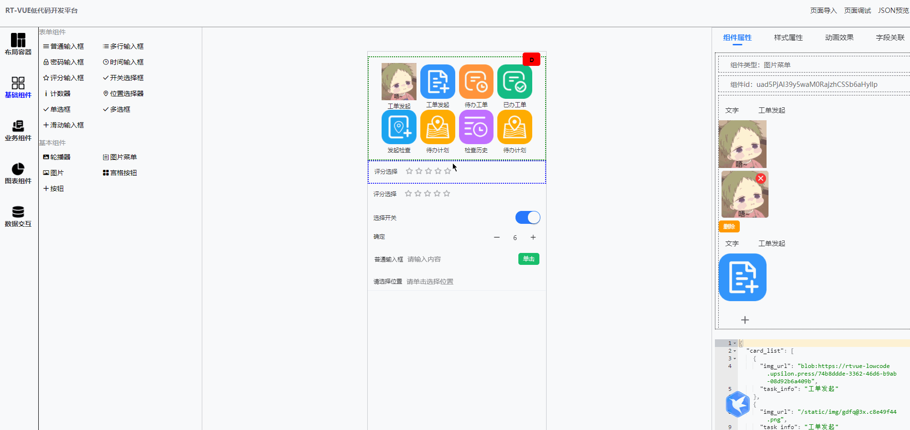

# rtvue-lowcode
rtvue-lowcode是一款基于uniapp框架和uview组件库开发的app可视化拖拽项目,采用MIT开源协议，适用于app、小程序等项目开发，真正意义上做到了开箱即用！

希望大家能给我们个小小的star，每个star对我们来说都很珍贵，希望能激励我们团队将项目认认真真地做完。


动画演示：



目前项目正在开发中，完整版本还未发布。项目预览地址 [Project Preview Address](https://rtvue-lowcode.upsilon.press/#/)
# 项目运行安装
克隆后直接安装即可
```
yarn install && yarn serve

```


# 自定义组件开发步骤

准备自定义组件开发之前，需要将rtvue-lowcode项目克隆到本地。
组件开发分为3个步骤：

1. 定义组件
2. 可拖拽组件
3. 配置组件
## 定义组件
### 创建组件文件
首先在src/components 目录下定义组件，目录名和文件要严格保持一致，目录命名格式为`r-组件名称`，文件命名格式为`r-组件名称.vue`。
例如：文件目录名为`r-form-input`
则文件名为：`r-form-input.vue`
### 混入组件代码
创建组件后，需要将`rvuecomp`混入到组件内部这里。代码举例如下：`r-form-input`所示

```html
<script>
    import {rvuecomp} from '../mixins/r-vue-comp' //<----在这里将组件混入进去
    export default {
        name: "r-form-input",
        mixins:[rvuecomp] //<----在这里将组件混入进去
    };
</script>
```
其中在`r-vue-comp`中主要定义了组件需要的参数类型，目前计划有两种参数类型：`option`和`compStyle`。

其中`option`代表了组件的配置信息，例如一个输入框的左标签，默认数值等等。

`compStyle`代表了控件容器的CSS。可以在控件的根`view`标签中，使用`:style='compStyle'`方法将`style`和`compStyle`绑定到一起。
```javascript
export const rvuecomp = {
    props: {
        option: {
            type: Object,
            require: true,
        },
        compStyle: {
            type: Object,
            require: false,
        },
    },
}
```
完成以上操作，即可定义了一个新的控件。随后我们的任务是将默认的数据放入`components/mixins/default_data.js`中，例如`r-form-input`中，默认数据如下所示：

```javascript
const rFormInput = {
  type: "r-form-input",
  option: {
    value: "",
    label: "普通输入框",
    placeholder: "请输入内容",
    btn:{
      getCode:()=>{

      },
      codeText:'单击'
    }
  },
  compStyle: {
    height: "auto",
    width: "100%",
    "font-size": "24rpx",
    "background-color": "#fff",
    "margin-top": "0",
    "margin-right": "0",
    "margin-down": "0",
    "margin-left": "0",
  }
}

```
完成以上操作后就定义了一个组件。
## 可拖拽组件
### 定义标签名称
首先要在`src/pages/labels`中将`r-组件名称`放入`tags`数组中。
例如在`r-form-input`中,标签可命名为
```javascript
 { text: "普通输入框", type: "r-form-input" },
```

### 拖拽后加载默认数据

在`src/components/r-vue-edit`中在`methods:{addComp}`方法中加入`case:'组件类型'`选择器，并将默认数据加入到`options`里面，例如：
```javascript
case "r-form-input":
    this.options.splice(index, 0, this.getData(this.rFormInput, this));
    break;
```
完成以上操作后即可在屏幕上即可生成一个可拖拽组件，这个组件可以向容器中拖入。


## 配置组件

在`pages/sidebar/option-bar/`中需要对每个组件的`option`做配置页面。

命名格式为：`option-r-组件名称-bar.vue`
例如:`option-r-form-input-bar.vue`即可自动将组件和配置页面绑定在一起。
# 目录结构
```
├─components
│  ├─libs  
│  │  └─css
│  ├─mixins
│  ├─r-** //组件
|
├─pages
│  ├─index //首页布局
│  ├─labels //左边可拖动栏
│  ├─preview // 预览页面
│  ├─scss //样式文件夹 如果有scss较大可放里面
│  ├─sidebar  //右边配置栏
│  │  ├─option-bar //基础属性
│  │  └─style-bar//
│  └─test//测试文件
├─static
│  ├─equip
│  ├─icons
│  └─jsons //默认数据
├─uni_modules//uni插件
│  ├─qiun-data-charts
│  │  ├─components
│  │  │  ├─qiun-data-charts
│  │  │  ├─qiun-error
│  │  │  └─qiun-loading
│  │  ├─js_sdk
│  │  │  └─u-charts
│  │  └─static
│  │      ├─app-plus
│  │      └─h5
│  └─uni-datetime-picker
│      └─components
│          └─uni-datetime-picker
└─utils//常用js工具
```
